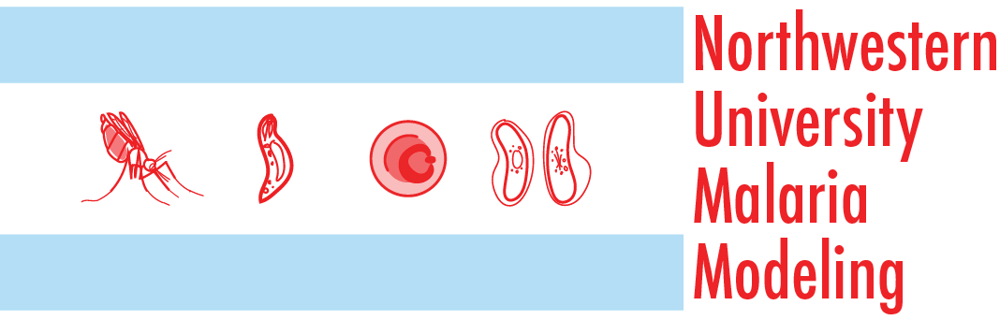

```{r, include=FALSE}
knitr::opts_chunk$set(
  results='asis', 
  echo = FALSE
)
library(tidyverse)
library(glue)

# Set this to true to have links turned into footnotes at the end of the document
PDF_EXPORT <- FALSE

# Holds all the links that were inserted for placement at the end
links <- c()

source('parsing_functions.R') # Functions for building sections from CSV data
source('common_variables.R')  # Small variables for non-csv data such as intro text

# First let's get the data, filtering to only the items tagged as
# Resume items
position_data <- read_csv('positions.csv') %>% 
  filter(in_resume) %>% 
  mutate(
    # Build some custom sections by collapsing others
    section = case_when(
      section %in% c('research_positions', 'industry_positions') ~ 'positions', 
      section %in% c('data_science_writings', 'by_me_press') ~ 'writings',
      section %in% c('academic_articles', 'academic_press') ~ 'academic_work',
      TRUE ~ section
    )
  ) 

```


Aside
================================================================================


{width=100%}

Contact {#contact}
--------------------------------------------------------------------------------


- <i class="fa fa-envelope"></i> sebastian@rodriguez.cr
- <i class="fa fa-github"></i> github.com/srodriguez0
- <i class="fa fa-linkedin"></i> linkedin.com/in/sebastian-rodriguez-509528aa
- <i class="fa fa-phone"></i> +1 (814) 441 2781


Language Skills {#skills}
--------------------------------------------------------------------------------


```{r}
build_skill_bars(skills)
```

::: aside
<p style="font-family: calibri; font-size:11pt; font-style:italic"> </p>
:::

<!-- Open Source Contributions {#open-source} -->
<!-- -------------------------------------------------------------------------------- -->

<!-- All projects available at `github.com/nstrayer/<name>` -->


<!-- - `shinysense`: R package to use sensor data in Shiny apps -->
<!-- - `tuftesque`: Hugo theme (behind LiveFreeOrDichotomize.com) -->
<!-- - `slid3r`: D3 add-on for fully svg slider inputs -->


Disclaimer {#disclaimer}
--------------------------------------------------------------------------------

<!-- Made w/ [**pagedown**](https://github.com/rstudio/pagedown). -->


Main
================================================================================

Sebastian Rodriguez {#title}
--------------------------------------------------------------------------------

```{r}
cat(sanitize_links(intro_text))
```


Education {data-icon=graduation-cap data-concise=true}
--------------------------------------------------------------------------------

```{r}
position_data %>% print_section('education')
```


Selected Positions {data-icon=suitcase}
--------------------------------------------------------------------------------


```{r}
position_data %>% print_section('positions')
```


Selected Talks & Publications   {data-icon=book}
--------------------------------------------------------------------------------
::: aside
<p style="font-family: calibri; font-size:11pt; font-style:italic"> </p>
:::

```{r}
print_section(position_data, 'academic_work')
```
